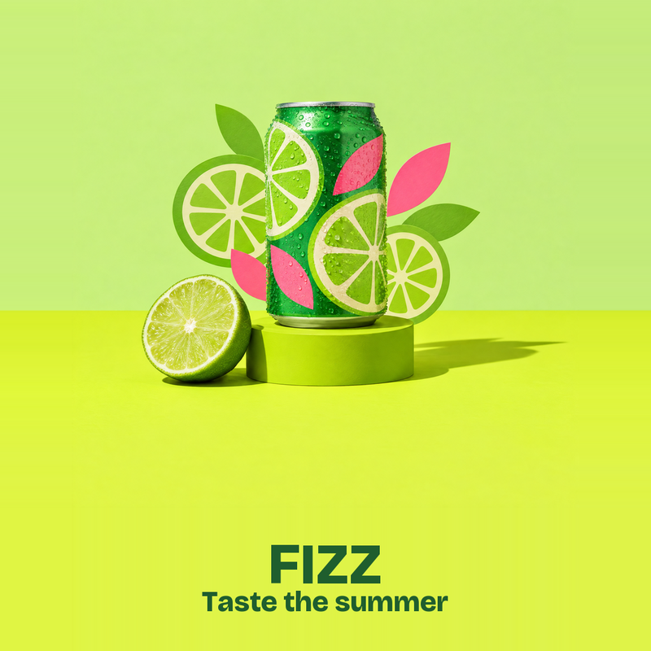
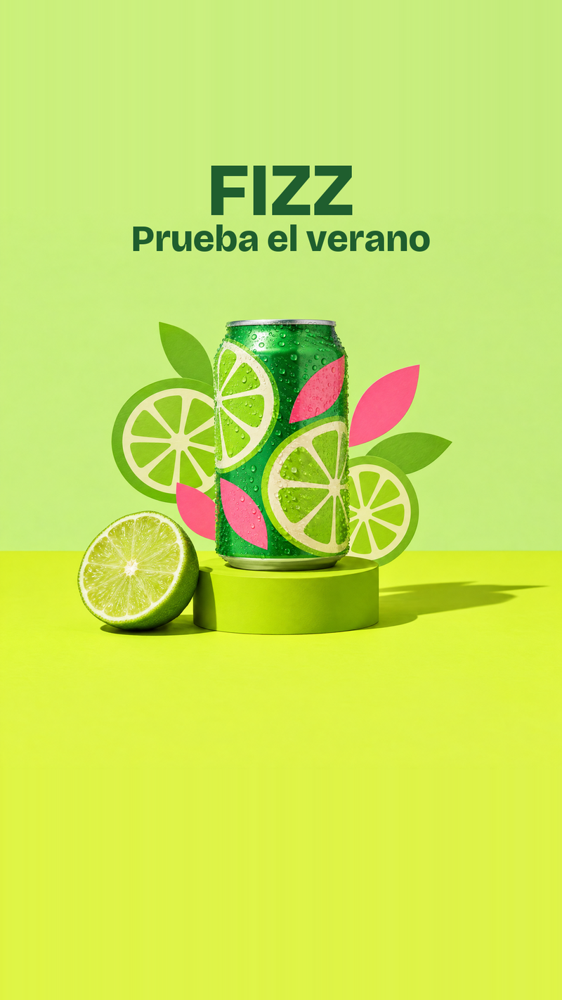
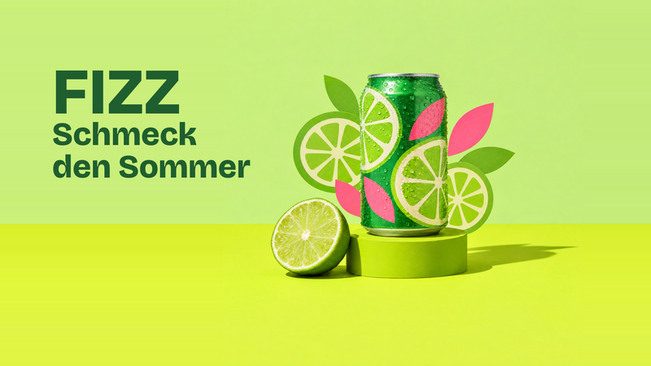
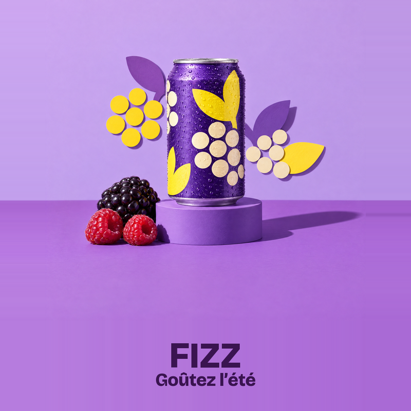
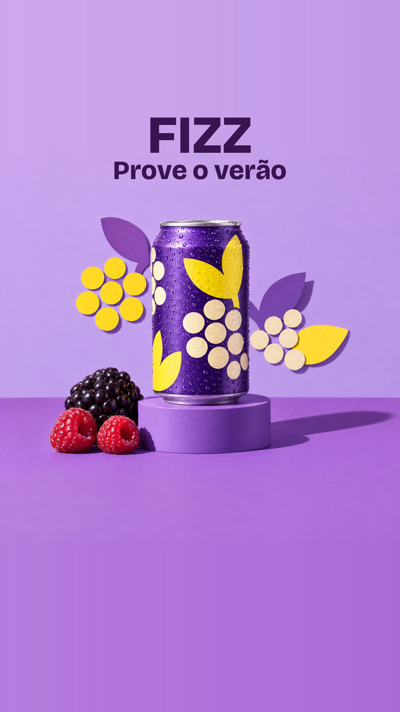
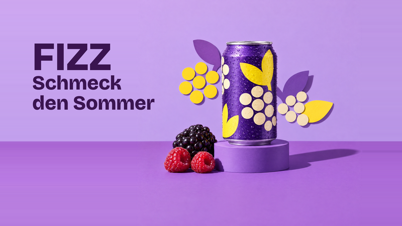

# FIZZ creative automation pipeline

## What it does

It turns one campaign brief into localized social ads: 2 products × 5 locales × 3 aspect
ratios = 30 creatives, plus a manifest that records every check. The AI makes one text-free
hero image per product, and code adds all brand type, color and layout on top of it.
Heroes are generated once, approved by a human, and reused, so a normal run costs nothing.

Scope: the brief suggested 2-3 hours; the working end-to-end pipeline is commit 0b99e6a. Later
commits are deliberate quality passes, each described in git log.

| | 1:1 | 9:16 | 16:9 |
|---|---|---|---|
| **Citrus** |  |  |  |
| **Berry** |  |  |  |

Samples are downscaled to 800 px wide; the real outputs are 1080×1080, 1080×1920 and 1920×1080.

## Quick start

Python 3.13.

```bash
python3 -m venv .venv && source .venv/bin/activate
pip install -r requirements.txt
cp .env.example .env          # add ELEVENLABS_API_KEY only for real runs
pytest                        # optional
```

Mock run (no key, no network). It reuses the approved heroes in `assets/products/`:

```bash
python -m pipeline run examples/brief.json
```

Real run through ElevenLabs. Heroes are only generated for products with no approved
hero, so point `--assets` at an empty folder to actually spend:

```bash
mkdir -p /tmp/no-heroes
python -m pipeline run examples/brief.json --provider elevenlabs --assets /tmp/no-heroes
```

The model defaults to `hero_model` in `examples/brand.json` (GPT Image 2.5 Sunburst).
To try another model for one run, add `--model gemini-3-pro-image`.

Output lands in `outputs/<campaign_id>/`: creatives at
`<product>/<locale>/<ratio>/<product>_<ratio>_<locale>.png`, `manifest.json`, `debug/`
overlays, and `heroes/` for any freshly generated hero. The CLI prints a summary table.

## How it works

Full signatures and flow: [docs/stages.md](docs/stages.md).

1. **load_inputs**: validate brief and brand, check font, palette, prompt vars, and that every tagline fits its zone.
2. **check_copy**: scan every message for prohibited words; stop before any spend.
3. **get_hero**: reuse `assets/products/<id>.png`, or generate from the prompt template and save it immediately.
4. **subject_box**: find the can and props by color difference from the sampled wall and floor.
5. **fit_to_ratio**: scale and edge-pad the hero to 1:1, 9:16 or 16:9; never crop.
6. **render_creative**: set the FIZZ wordmark + tagline lockup in its fixed zone, choosing the color by contrast.
7. **check_brand**: measure contrast, subject overlap and brand color share.
8. **save_run**: write creatives, debug overlays and the manifest; then the CLI applies the QA gate.

| Exit | Meaning |
|---|---|
| 0 | All creatives written, QA gate passed |
| 1 | Input or provider error: blocked copy, invalid brief/brand, tagline can't fit, non-square hero, missing file, API failure |
| 2 | Usage error, e.g. unknown `--model` or `--provider` |
| 3 | QA gate: a lockup overlaps the subject; everything is written for review, manifest `status: "qa_failed"` |

## Key decisions

**Fail before spending.** Pydantic validation, banned-word scanning and the tagline fit check all
run at load, before any image request. Zones and font are fixed, so a line that won't fit is known
up front. A blocked run writes nothing and costs $0.

**One approved hero per product, reused across 30 ads.** A human copies a generated hero into
`assets/products/` with a JSON sidecar (model, resolution, exact prompt, who approved it and when).
The models take no seed, so reproducibility comes from the approved file, not from regeneration.

**Provider slot and model as config.** `ImageProvider` is a small protocol (mock, ElevenLabs).
The model comes from `hero_model` in [examples/brand.json](examples/brand.json), `--model` overrides
it for one run, and unknown ids fail before a request. One model per run.

**Code owns all brand text.** The AI image contains no text; code sets a Bricolage Grotesque
type lockup at a fixed type scale per ratio. The deep product color is used unless it measures
below 4.5:1 against the pixels behind it, then cream, or whichever measures higher.
See [docs/creative-spec.md](docs/creative-spec.md) (B2, B5).

**QA gate on real subject pixels.** Overlap is checked against the subject mask, not its bounding
box, so type in an empty corner beside the props passes. Each creative gets a debug overlay
(subject box magenta, lockup box cyan) because the color-based mask can miss parts.

## Assumptions & limits

- **Translation, not transcreation.** The brief supplies one tagline per locale; the pipeline
  renders it as given and does no cultural adaptation.
- **Latin-script languages only** (en, es, pt, fr, de, it, nl). CJK and RTL fail at load with
  "not supported yet": the font lacks the glyphs and Pillow's basic layout has no bidi or CJK
  line breaking ([docs/stages.md](docs/stages.md)).
- **Fixed layout zones** per ratio. Placement doesn't adapt to the subject; the QA gate catches collisions.
- **Color-based subject detection.** Parts close to the wall or floor color (e.g. a plinth near the
  floor tone) can be missed; the overlays are the human check.
- **`brand_color_share` is near zero by design** (0.004–0.015). Set colors come from the hero
  prompt as color words; code adds only the lockup, so exact brand hex values are rare in the image.
- **Berry 1:1 measures 4.3–4.4 contrast**: below the 4.5 brand bar, above WCAG AA large-text 3:1.
  Cream measures lower on that orchid floor, so the rule keeps the deep color. The fallback band
  behind the tagline is deferred.
- Heroes are 2K 1:1 and downscaled to 1080 px; nothing is upscaled.

## Next steps

Production
- Attach C2PA Content Credentials to heroes and creatives, replacing the JSON sidecar as provenance.
- Add Adobe Firefly as a provider behind the existing `ImageProvider` slot.
- Stale-hero check: warn when an approved hero's sidecar prompt no longer matches the current template and vars.

Creative QA
- Subject-aware layout: replace the fixed `lockup_zone` so type moves away from the subject, with the deferred fallback band.
- OCR text gate on generated heroes, plus a multi-seed candidate command for human picking.

Scale
- Per-market banned words, so legal rules can differ by locale.
- Intake from a request form (e.g. Workfront) instead of a hand-written brief JSON.
- Run logging, so failed or partial runs are traceable (today a failed run leaves only `heroes/`).
